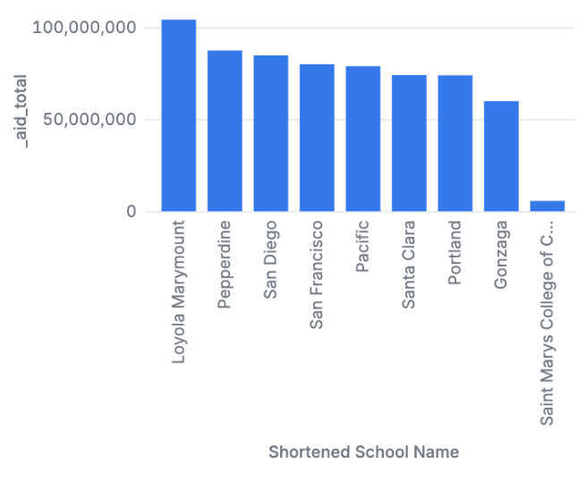
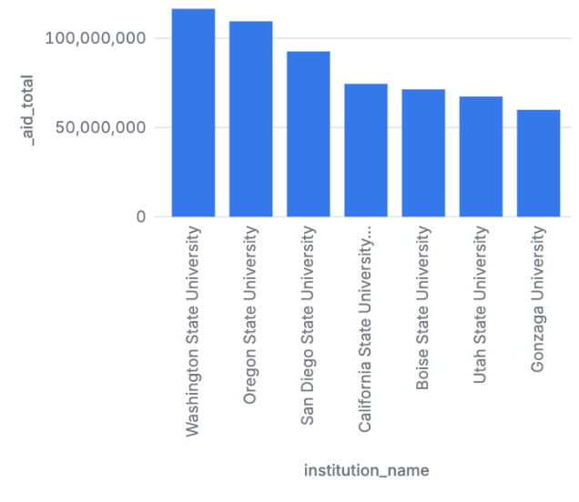
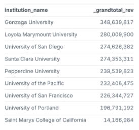
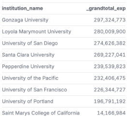
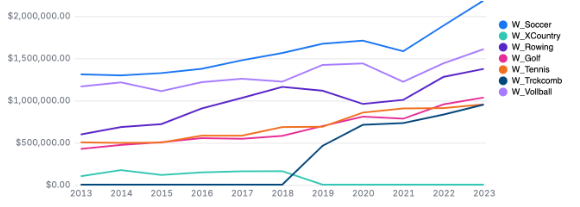
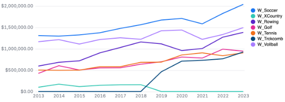
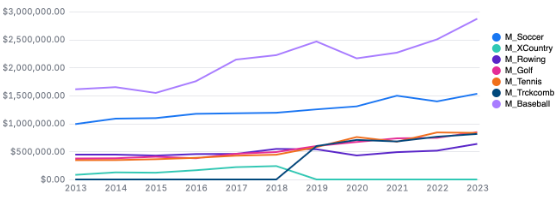
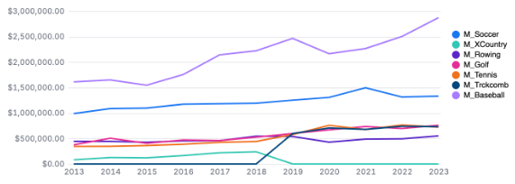
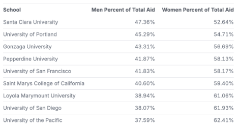
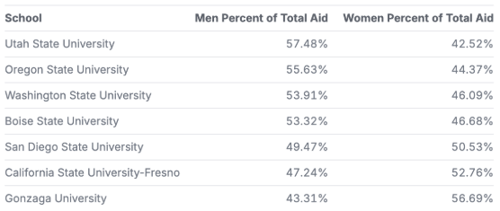

# Sports Equity Data

This repository contains data obtained by the US Department of Education, as can be seen [HERE](https://ope.ed.gov/athletics/#/).

## Code

This repository contains 11 .csv dataset files, 5 .parquet files, and 1 .malloynb analysis file: 
- [`sports_data.malloynb`](sports_data.malloynb), performs the analysis of the data provided by the Equity in Athletics Data Analysis. 
- [`data_2023.csv`](data_2023.csv), supports the analysis of the data provided by the Equity in Athletics Data Analysis.
- [`data_2022.csv`](data_2022.csv), supports the analysis of the data provided by the Equity in Athletics Data Analysis. 
- [`data_2021.csv`](data_2021.csv), supports the analysis of the data provided by the Equity in Athletics Data Analysis. 
- [`data_2020.csv`](data_2020.csv), supports the analysis of the data provided by the Equity in Athletics Data Analysis. 
- [`data_2019.csv`](data_2019.csv), supports the analysis of the data provided by the Equity in Athletics Data Analysis. 
- [`data_2018.csv`](data_2018.csv), supports the analysis of the data provided by the Equity in Athletics Data Analysis. 
- [`data_2017.csv`](data_2017.csv), supports the analysis of the data provided by the Equity in Athletics Data Analysis. 
- [`data_2016.csv`](data_2016.csv), supports the analysis of the data provided by the Equity in Athletics Data Analysis. 
- [`data_2015.csv`](data_2015.csv), supports the analysis of the data provided by the Equity in Athletics Data Analysis. 
- [`data_2014.csv`](data_2014.csv), supports the analysis of the data provided by the Equity in Athletics Data Analysis. 
- [`data_2013.csv`](data_2013.csv), supports the analysis of the data provided by the Equity in Athletics Data Analysis.
- [`inst-2021-2022.parquet`](inst-2021-2022.parquet), supports the analysis of the data provided by the Equity in Athletics Data Analysis.
- [`inst-pre2021.parquet`](inst-pre2021.parquet), supports the analysis of the data provided by the Equity in Athletics Data Analysis.
- [`school-2022.parquet`](school-2022.parquet), supports the analysis of the data provided by the Equity in Athletics Data Analysis.
- [`schools-2020.parquet`](schools-2020.parquet), supports the analysis of the data provided by the Equity in Athletics Data Analysis.
- [`schools-2021-2022.parquet`](schools-2021-2022.parquet), supports the analysis of the data provided by the Equity in Athletics Data Analysis.

## Description of Project
This project analyzes data from the Equity in Athletics Disclosure Act (see listing above) to explore trends in college sports equity, including funding, participation, and resource allocation across different institutions. Using Malloy, we developed a structured approach to answer key analytical questions and provide insights into the world of equity in college athletics. In particular, we focused our analysis on athletic scholarship funding differences between conferences, revenue and expense disparities between men and women's sports at Gonzaga, Title IX gender ratios for student-athletes, and which sports generate the most and least revenue in the WCC and future Pac-12 conference.

NOTE: St. Mary's University of California does not have data past 2013 in this dataset. You will see their numbers staggeringly low.

## Motivation 

With the introduction of NIL deals into the collegiate world of athletics, gender equity has once again risen to the forefront of issues in this realm. With this in mind, we looked at the revenues and expenditures given by every sport, men and women's scholarship distributions, and other important demographics to decipher the hidden trends and meanings in the datasets across college campuses in the United States. Our analysis specifically was geared towards schools within the future PAC-12 and within the West Coast Conference (WCC). With Gonzaga University planning to head towards the Pac-12 and leave the WCC this leaves a lot of unanswered questions and a lot of room for analysis to assist in this process. See this [article](https://www.laloyolan.com/sports/gonzaga-is-heading-to-the-pac-12-what-does-this-mean-for-the-wcc-and/article_da2da742-81f0-11ef-b5f8-0302ccb8256e.html) to see how a sports editor at the Los Angeles Loyolan talks more about the uncertain future of the WCC as Gonzaga heads toward the Pac-12.

## Summary of Findings

Question 1: How does aid differ between the current WCC teams and future Pac-12 teams?

Interestingly, Gonzaga gives the lowest aid for sports out of every school in both the WCC and future Pac-12. This could be due to a number of reasons, likely because aid is prioritized elsewhere considering 98% of undergraduate students receive some kind of aid. Further breaking down the WCC, Gonzaga has made over 65 million more dollars in revenue over the past decade while only having 17 million more dollars in revenue. This begged the question to look at our profit/loss per year, which can be found in our malloy file. Gonzaga was among the top 12 most profitable schools during the (2013-2023) sports seasons.

Question 2: How do revenues and expenses differ between the men's and women's teams at Gonzaga?
Note: We decided to separate the data for men's and women's basketball teams because their financial figures significantly skewed the overall results. You can review these specific graphs in our code after the analysis of other sports' revenues and expenses.
Women's Sports Revenues and Expenses:
Across Gonzaga's women's sports teams, most have consistently operated at a slight loss or broke even nearly every year. This trend is observed across the board, with no single sport standing out in terms of significant profit or loss. It’s also important to note that women's cross country was integrated into track and field starting in 2018, which may impact both the revenue and expense breakdowns for those years.
Men's Sports Revenues and Expenses:
Similarly, the men's sports teams tend to operate in a comparable financial situation. However, one notable exception is the men's baseball team, which has consistently been the highest earner and spender, with the exception of men's basketball. This team’s performance and financials differ from the general trend we see across other men’s sports.
Basketball Team Financial Comparison:
When comparing the two basketball programs:
The women's basketball team reported a loss of approximately $500,000 last year.
The men's basketball team, in stark contrast, generated a revenue of $7 million last year.
This discrepancy highlights the significant financial gap between the men's and women's programs, which is often seen in college athletics.
Question 3: What are Title IX gender ratios for student athletes by school? Which Schools have a skewed distribution?

Looking at our future Pac-12 schools, Gonzaga gives the least aid to their men's team and the most towards their women's teams. However, if you look at the WCC schools, Gonzaga gives the third most to our men's teams at 43.3% of total aid.

Question 4: Which men's and women's sports generate the most and the least amount of revenue?

For men's sports, as expected, football brought in the most revenue by a very large margin at 7 billion dollars last year. Basketball was the second biggest money maker bringing in 2.6 billion dollars last year, then baseball and the rest of the sports.

For women's sports, Basketball easily brought in the most money at 1.2 billion last year. Soccer, Volleyball, and Softball all are very similar, slightly above the 600 million mark.

Please see the table below for a sample of screenshots of visualizations that will be shown in the analysis: 
| **Description**   | **Visualization Preview** |
|--------|-----------|
| `Total Aid in the WCC` |  |
| `Total Aid for the future Pac 12` |  |
| `WCC Revenue by School` |  |
| `WCC Expenses by School` |  |
| `Gonzaga Womens Sports Expenses - no basketball` |  |
| `Gonzaga Womens Sports Revenues - no basketball` |  |
| `Gonzaga Mens Sports Expenses - no basketball` |  |
| `Gonzaga Mens Sports Revenues - no basketball` |  |
| `Men and Women Percent of WCC Aid` |  |
| `Men and Women Percent of Future Pac 12 Aid` |  |

## Description of how others can build off of this work

Others can build off this work in various ways. Data analysts could use the trends in this project to forecast estimated future scholarship distributions to various student athletes. Decision makers at a university administrative level could use the information to improve the effectiveness of revenues and expenses being allocated between sports. Finally, the general public could build off this work by applying more measures and dimensions to clarify understanding of the complex datasets.

## Data cleaning steps

To be able to run this dataset, we joined every year of data using a SQL function and then proceeded to “clean” our data. In our cleaning, a larger section was changing the data types of our revenues and expenses columns to numbers so we were able to conduct meta analysis on the data. We also shortened University’s names by removing a leading “University of”, “University”, or “The”, so that in our visualizations, the data is presented in a more readable way. The last section of this cleaning was creating sums and percentages for our scholarship/aid data. This allowed us to make our code and our visualizations more readable.

## Directions on how to use the github web editor to run the same analysis

Are you logged into github? Just press the period key right now. This will load the web editor. Then install the malloy extension. See images below for reference:
| **Step**   | **Image Preview** |
|--------|-----------|
| `Step 1 - Press allow` |  |
| `Step 2 - Click the Blocks, search for Malloy, install` |  |
| `Step 3 - Click Trust` |  |
| `Step 4 - Click a .malloynb file` |  |
| `Step 5 - Press Run` |  |

## Licensing

The files provided directly via the US Department of Education (see listing above) are now in the public domain. All other data files have been generated by Josh Hyer, Felix Robertson, Nick Stalder, Logan Fitzpatrick, Wendy McCann, Isabella Favorito, and Norhan Ali for Gonzaga University Graduate School of Business as part of the MSBA-622-01 Data Science for Business (Spring 2025) course and are available under ‘Creative Commons’ [CC BY-SA 4.0 license terms](https://creativecommons.org/licenses/by-sa/4.0/). This repository’s code is available under the [MIT License terms](https://opensource.org/license/mit/).
